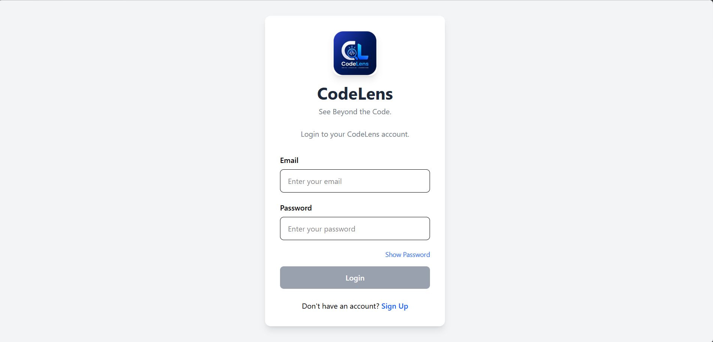
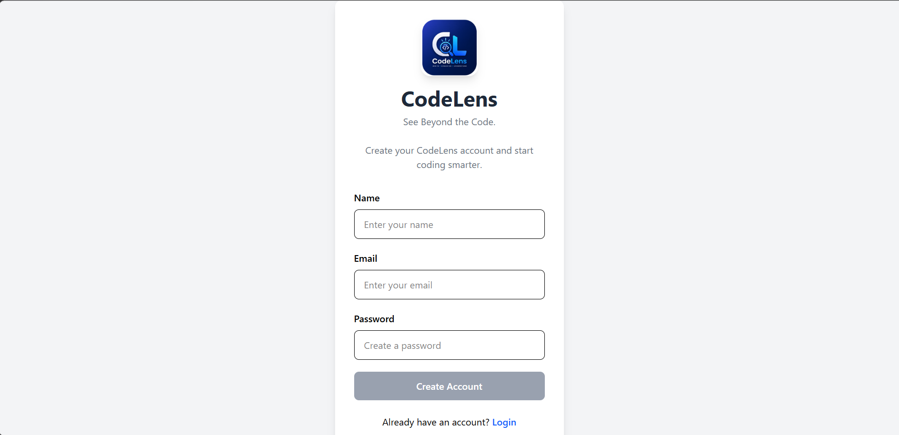
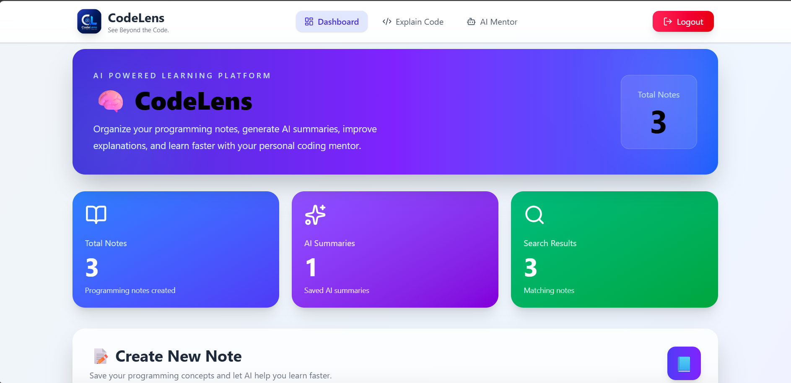
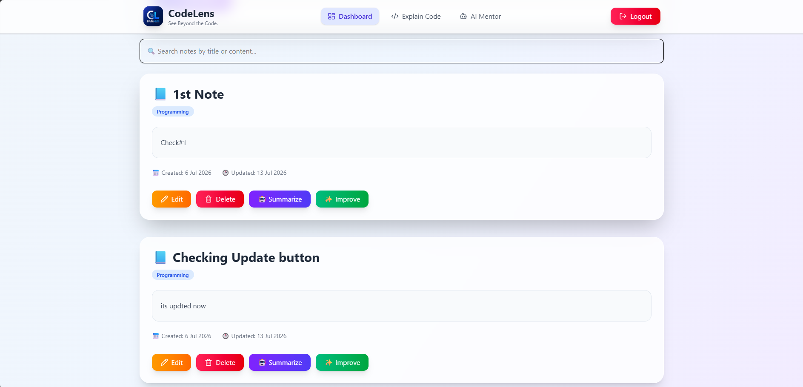
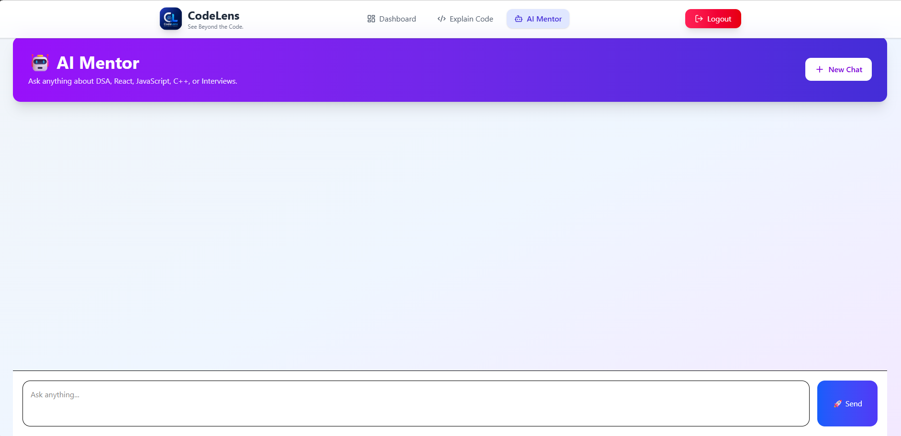
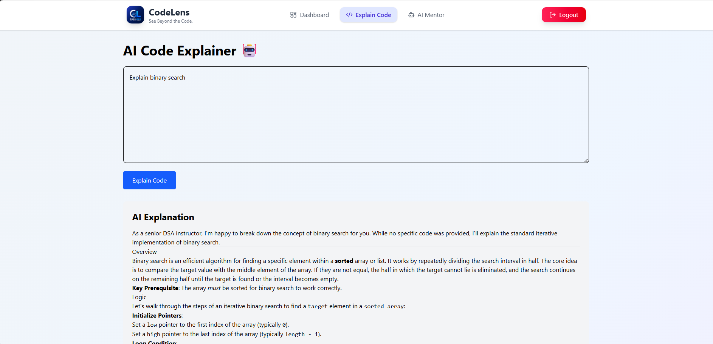

# 🚀 CodeLens – AI-Powered Programming Companion

CodeLens is a full-stack MERN application that helps programmers write, organize and understand programming notes with AI. It provides secure authentication, AI-powered note summarization, an AI Mentor chatbot, and code explanation using Google's Gemini API.

🌐 **Live Demo:** https://code-lens-rust.vercel.app

💻 **GitHub Repository:** https://github.com/Civansss/CodeLens

---

## ✨ Features

- 🔐 Secure JWT Authentication
- 📝 Create, Update and Delete Programming Notes
- 🔍 Instant Note Search
- 🤖 AI Mentor powered by Google Gemini
- 📄 AI Note Summarizer
- 💡 Explain Code with AI
- 📱 Fully Responsive UI
- ⚡ Toast Notifications
- 🛡 Protected Routes
- 🎨 Modern UI using Tailwind CSS

---

# 📸 Screenshots

## Login



---

## Signup



---

## Dashboard



---

## Notes



---

## AI Mentor



---

## Explain Code



---

# 🛠 Tech Stack

### Frontend

- React.js
- React Router
- Tailwind CSS
- React Hot Toast
- React Markdown
- Lucide React

### Backend

- Node.js
- Express.js

### Database

- MongoDB
- Mongoose

### Authentication

- JWT (JSON Web Tokens)
- bcrypt.js

### AI

- Google Gemini API

### Deployment

- Vercel (Frontend)
- Render (Backend)

---

# 📂 Project Structure

```
CodeLens
│
├── client
│   ├── src
│   ├── public
│   └── package.json
│
├── server
│   ├── controllers
│   ├── middleware
│   ├── models
│   ├── routes
│   ├── config
│   └── server.js
│
├── codelens_screenshots
│
└── README.md
```

---

# ⚙ Installation

## Clone Repository

```bash
git clone https://github.com/Civansss/CodeLens.git
```

```
cd CodeLens
```

---

## Backend Setup

```
cd server
npm install
```

Create a `.env` file inside the **server** folder.

```
MONGODB_URI=your_mongodb_uri
JWT_SECRET=your_secret_key
GEMINI_API_KEY=your_gemini_api_key
PORT=8000
```

Run backend

```
npm start
```

---

## Frontend Setup

```
cd client
npm install
npm run dev
```

---

# 🔒 Authentication

- JWT Authentication
- Password Hashing using bcrypt.js
- Protected Routes
- Secure API Access

---

# 🤖 AI Features

### AI Mentor

Ask programming-related questions and receive detailed explanations generated using Google Gemini.

### AI Summarizer

Generate concise summaries for programming notes.

### Explain Code

Paste any code snippet and receive an AI-generated explanation.

---

# 🌍 Deployment

Frontend

- Vercel

Backend

- Render

---

# 🚀 Future Improvements

- Dark Mode
- AI Flashcards
- Export Notes as PDF
- Folder Management
- Code Syntax Highlighting
- Markdown Editor
- Favorite Notes
- Profile Page

---

# 👨‍💻 Author

**Shivansh Srivastava**

GitHub:
https://github.com/Civansss

---

## ⭐ If you like this project

Give this repository a **Star ⭐** on GitHub!